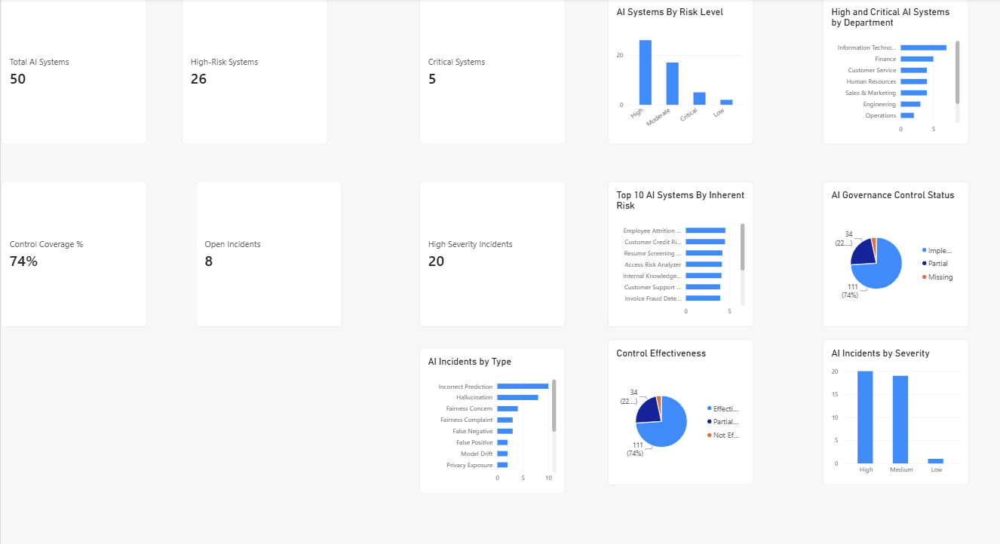
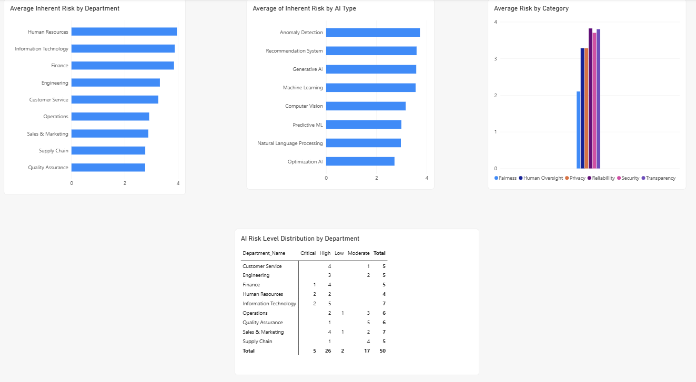
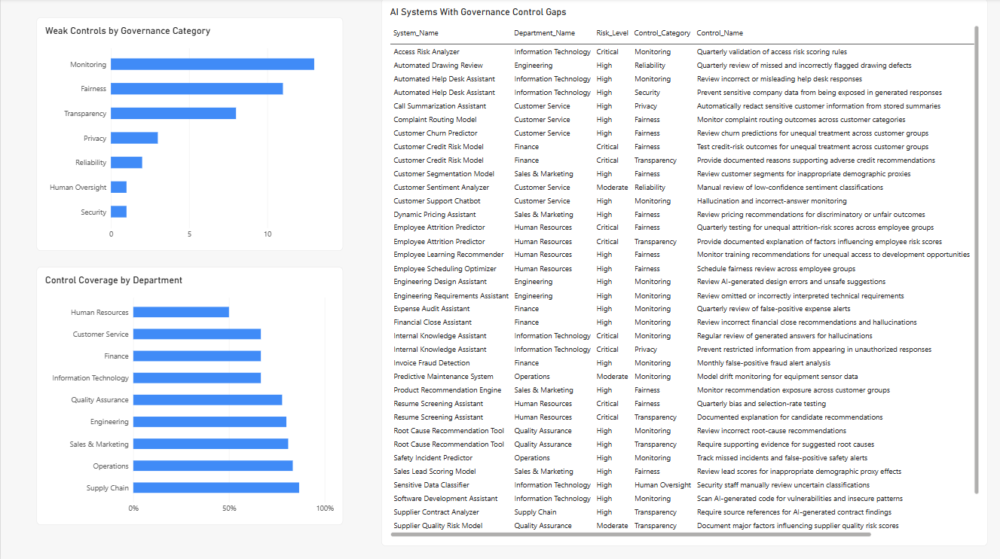
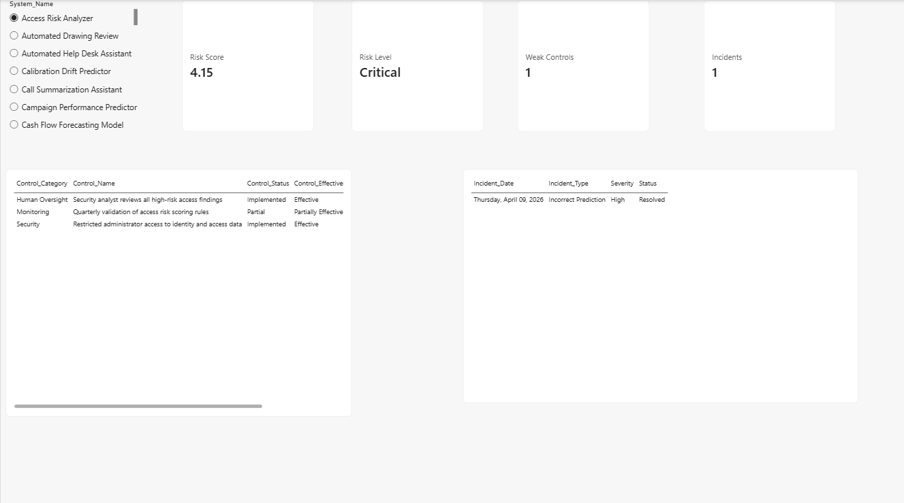

# Enterprise AI Governance, Risk & Remediation

A portfolio project simulating an enterprise AI governance program for **NorthStar Manufacturing Inc.** The project inventories AI systems, assesses inherent risk, evaluates governance controls, analyzes incidents, prioritizes remediation, and translates findings into a structured governance improvement plan.

> **Portfolio note:** NorthStar Manufacturing, its AI systems, incidents, and results are fully synthetic and were created for learning and portfolio demonstration.

## Project workflow

`AI Inventory → Risk Assessment → Controls → Incidents → SQL Analysis → Power BI → Prioritization → Remediation → Project Governance`

## Executive dashboard



The refreshed Power BI dashboard tracks:

- **50** AI systems
- **5 Critical** and **26 High-Risk** systems
- **74%** effective governance-control coverage
- **8** open / investigating incidents
- **20** high-severity incidents

## Dataset

| Table | Records | Purpose |
|---|---:|---|
| Departments | 9 | Organizational ownership |
| AI Systems | 50 | Enterprise AI inventory |
| Risk Assessments | 50 | Six-dimensional inherent-risk assessments |
| Governance Controls | 150 | Three controls per AI system |
| AI Incidents | 40 | Simulated AI incident history |

Risk is assessed across **Privacy, Fairness, Security, Reliability, Transparency, and Human Oversight**.

## Risk methodology

Weighted inherent-risk score:

`0.20 × Privacy + 0.20 × Fairness + 0.15 × Security + 0.15 × Reliability + 0.15 × Transparency + 0.15 × Human Oversight`

Risk bands:

- **Critical:** score ≥ 4.00
- **High:** score ≥ 3.00 and < 4.00
- **Moderate:** score ≥ 2.00 and < 3.00
- **Low:** score < 2.00

Corrected risk distribution:

- Critical: **5**
- High: **26**
- Moderate: **17**
- Low: **2**

## SQL analysis

The SQLite workflow answers eight governance questions:

1. Which departments contain the most High/Critical AI systems?
2. Which AI systems have the highest inherent risk?
3. Which High/Critical systems also have weak or missing controls?
4. What is governance-control coverage by department?
5. Which AI systems have the most incidents?
6. Which High/Critical systems have severe incidents?
7. Which systems have overdue governance-control reviews?
8. Which systems require the most immediate governance attention?

The final governance-priority score is a **project-defined prioritization metric**, not an official NIST/ISO formula:

`Risk Score + 0.5 × Weak Controls + 1.0 × High-Severity Incidents`

### Highest-priority systems

| Rank | AI System | ID | Priority Score |
|---:|---|---|---:|
| 1 | Customer Credit Risk Model | AI033 | 7.50 |
| 2 | Employee Attrition Predictor | AI046 | 6.55 |
| 3 | Resume Screening Assistant | AI001 | 6.20 |
| 4 | Internal Knowledge Assistant | AI010 | 6.10 |
| 5 | Access Risk Analyzer | AI015 | 5.65 |

## Power BI report

The report contains four pages:

### 1. Executive Overview
High-level KPIs, risk distribution, departmental exposure, control status, and incident trends.

### 2. AI Risk Analysis


Compares inherent risk by department and AI type, summarizes average risk by category, and shows the risk-level distribution by department.

### 3. Governance & Controls


Highlights control coverage, weak controls by governance category, and system-level control gaps.

### 4. AI System Detail


Provides a single-system drill-down for risk score, risk level, weak controls, incidents, detailed controls, and incident history.

## Remediation program

The analysis is extended into an implementation layer containing:

- Risk-based remediation plan
- Project charter
- Six-month implementation roadmap
- Project risk register
- RACI matrix
- Action owners, dependencies, and success metrics

This turns the project from a dashboard into a full **identify → assess → prioritize → remediate → monitor** governance workflow.

## Tools and skills demonstrated

- **SQL / SQLite:** joins, CTEs, CASE, COALESCE, aggregation, filtering, prioritization
- **Power BI / DAX:** data modeling, KPI measures, interactive visuals, slicers, drill-down analysis
- **Excel:** structured tables, weighted risk scoring, remediation planning, project roadmap
- **Risk & Governance:** inherent risk, control effectiveness, incidents, remediation, accountability
- **Project Management:** charter, dependencies, risk register, RACI, milestones, success metrics

## Repository structure

```text
data/                    Corrected CSV source tables
database/                SQLite database
sql/                     SQL analysis queries
workbook/                Excel source + remediation artifacts
powerbi/                 Refreshed PBIX report
powerbi/screenshots/     Dashboard screenshots
docs/                    Data audit and validation notes
```

## Data quality

The final project was audited for relational and analytical consistency. Corrections included realigning the risk-assessment mapping, removing an orphan risk row, recalculating weighted scores and risk levels, and updating the remediation plan to match the corrected governance-priority ranking.

See [`docs/DATA_AUDIT.md`](docs/DATA_AUDIT.md) for details.
